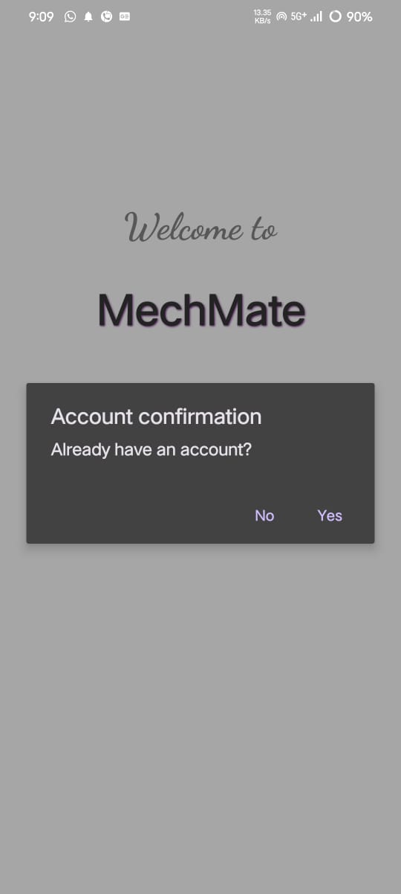
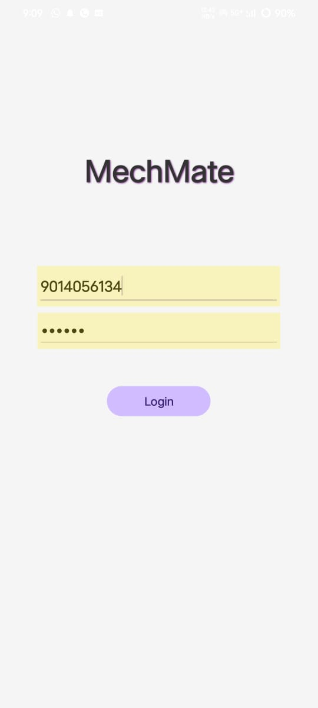
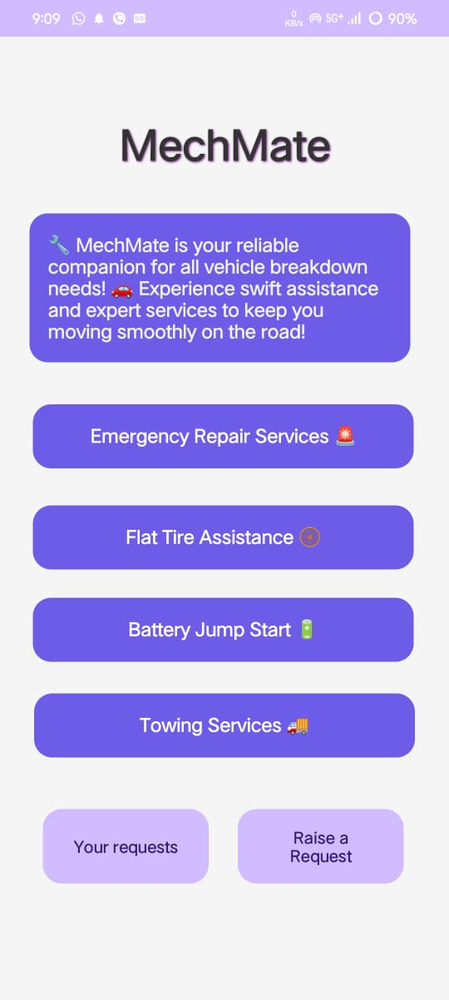
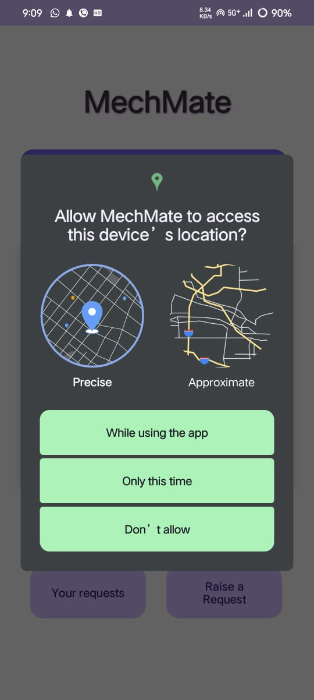
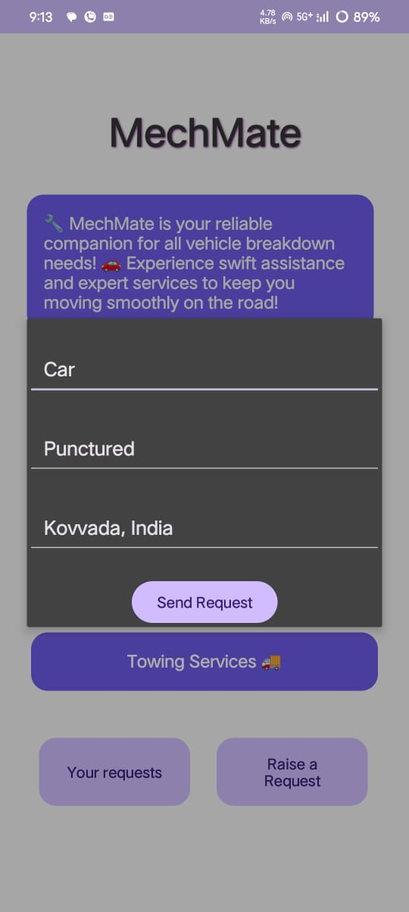
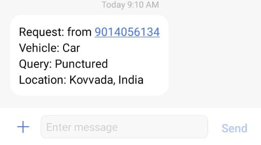

# MechMate

This GitHub repository contains the source code for the **MechMate** Android application, designed to assist users in requesting on-road vehicle breakdown services such as emergency repairs, towing, flat tire assistance, and more. The app enables users to request help from nearby mechanics by sending SMS notifications containing details like vehicle type, issue, and current location.

## Features

- **User Registration & Login:** Users can sign up and log in to access the app's features.
- **Raise a Request:** Users can specify the vehicle type and issue, and the app fetches their current location automatically.
- **SMS Notifications:** The app sends an SMS request to nearby mechanics, including the user's phone number, vehicle type, issue, and location.
- **Location Fetching:** The app automatically fetches the user's location using Google’s Fused Location API and converts it into a human-readable address.
- **Permission Handling:** The app requests permissions for accessing the user's location and sending SMS messages.
- **Dynamic UI:** The UI dynamically updates based on the request raised by the user.

## Implementation

The **MechMate** app is implemented using Java, XML for the UI, and Google's Fused Location Provider for location services. The app ensures that location and SMS permissions are properly handled, and provides an intuitive user interface for raising service requests.

### Key Components:
- **HomeActivity.java**: The main activity that handles user interactions like raising service requests, fetching locations, and sending SMS.
- **request_dialog.xml**: A dialog layout that prompts users to enter vehicle type, issue details, and automatically fills the current location.
- **AndroidManifest.xml**: Contains permission declarations for accessing location and sending SMS.

## How to Use

1. **Clone the repository** to your local machine using the command:
   ```bash
   git clone https://github.com/your-username/MechMate.git
   ```

2. **Open the project** in Android Studio.

3. **Run the app** on an emulator or connected device.

4. **Explore Features:**
   - Register and log in to the app.
   - Raise a request by selecting your vehicle type, issue, and location.
   - Once a request is raised, an SMS will be sent to nearby mechanics with all the necessary details.

## Database Integration

The app stores user requests in a Firebase Realtime Database. Each request contains details such as:
- User's phone number
- Vehicle type
- Query (problem description)
- Location (fetched from Google Maps API)

This allows for easy tracking of all raised requests and mechanics' responses.


## Technologies Used

- **Java**: Main programming language for app functionality.
- **XML**: For designing the user interface.
- **Google Fused Location API**: To fetch and convert the user's location.
- **SMS Manager**: To send service request notifications to mechanics.
- **Android Permissions**: To handle location and SMS permissions.

## Permissions

- **Location Permission**: To access the user’s current location.
- **SMS Permission**: To send SMS notifications with service request details.

## Screenshots

### Title Screen


### Confirm Account


### Login Screen


### Home Screen


### Raise Request and GPS Enabling


### Fetching Current Location and query details


### SMS Sent Confirmation

## How to Contribute

1. Fork the repository.
2. Create a new branch for your feature or bug fix.
3. Commit your changes and push them to the repository.
4. Create a pull request to have your changes reviewed and merged.

---

By following this documentation, you should be able to set up and run the **MechMate** app on your local machine, as well as contribute to the project.
